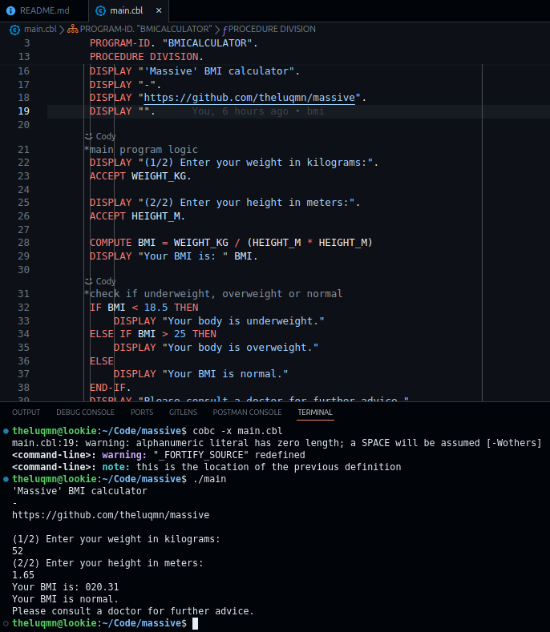

<!--
---
layout: post
title: Learned COBOL, some thoughts on it
description: Meddled with COBOL - and I have some thoughts on it
date: 16th February 2025
---

It was a fine Sunday morning, I did not sleep after 6 AM and got somewhat dull. Out of sheer boredom, I decided to learn COBOL. It should be noted that I have meddled with COBOL before, but never applied it to anything serious - all I did was write a basic program that prints "Hello World" to the console. A couple moments later, I find myself watching countless videos on YouTube about COBOL, in search of a video I find likeable, and decided to land on [this video](https://youtu.be/_pAX_ogguLI?si=gB5dzqALmha83qhM).

## Thoughts on COBOL

The most obvious thing that I noticed about COBOL is how verbose it is. COBOL is considered a self-documenting language, due to the verbosity of its syntax and naming conventions. Another obvious thing is the fact that COBOL code has these vertical lines that separate the code into different sections, and has a limit of 72 characters per line due to the fact that it was designed for punch cards? Oh it is because COBOL was made in 1959.

## Conclusion

I got used to writing COBOL rapidly and for some reason, I find it enjoyable to write. It has been a while since I worked on a new project, hence I decided to write a basic yet functional program using COBOL - "[Massive](https://github.com/theluqmn/massive)". Massive is essentially a BMI calculator, but it gave me the opportunity to apply various basic COBOL skills that I gathered into a neat little project. Working on Massive has been quite straightforward and enjoyable, and I am looking forward to learning more about COBOL and building more projects with it.

Below is a screenshot of the program:

-->
